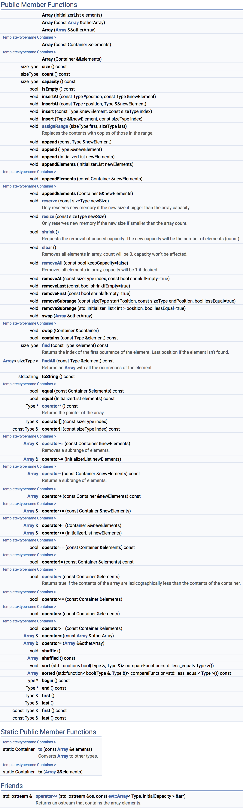

# **Array**.hpp

[](https://travis-ci.org/illescasDaniel/Array.hpp)
[](https://github.com/illescasDaniel/Array.hpp/releases)
[](https://github.com/illescasDaniel/Array.hpp/blob/master/LICENCE) 

Container to store data, similar to `std::vector` but with better syntax and performance.  
```diff
- Note: if the Array store objects of a Class, that class needs to have a default constructor.
```

## Benchmarks

**-O0**:

std::vector push_back: 0.797s  
std::vector emplace_back: 0.749s  
evt::**Array** Append: **0.218s**  
std::vector Removal: 0.584s  
evt::**Array** Removal: **0.123s**  
std::vector Insert at beginning: 1.62s  
evt::**Array** Insert at beginning: **1.61s**  
std::vector Insert at end: 1.302s  
evt::**Array** Insert at end: **0.435s**  

- TEST Class Benchmark (int,double,string)  

std::vector push_back: 7.409s  
std::vector emplace_back: 7.059s  
evt::**Array** Append: **6.518s**  

**-O2:**  

std::vector push_back: 0.173s  
std::vector emplace_back: 0.14s  
evt::**Array** Append: **0.076s**  
std::vector Removal: 0s  
evt::**Array** Removal: **0.07s**  
std::vector Insert at beginning: 1.568s  
evt::**Array** Insert at beginning: **1.579s**  
std::vector Insert at end: 0.189s  
evt::**Array** Insert at end: **0.183s**  

- TEST Class Benchmark (int,double,string)  

std::vector push_back: 4.693s  
std::vector emplace_back: 4.677s  
evt::**Array** Append: **4.503s**  

## API Reference


